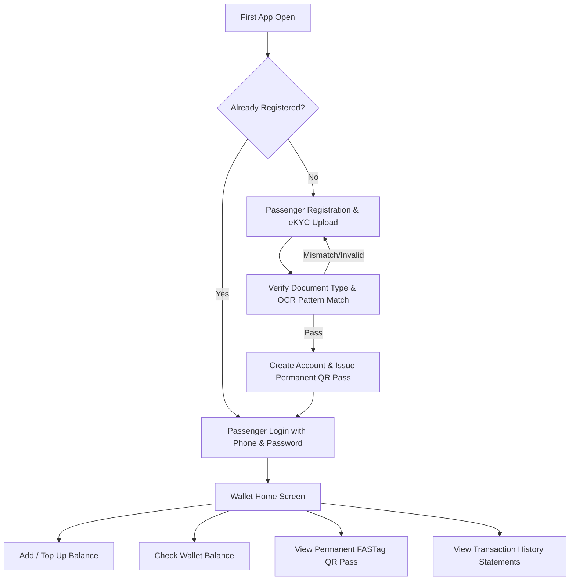

# Product Requirements Document (PRD): QR Bus Pass Wallet

**Product Name:** QR Bus Pass Wallet  
**Version:** 1.1 (Strict eKYC & Permanent FASTag Pass Specification)  
**Status:** Approved for Engineering Kickoff  
**Owner:** Product Management  
**Last Updated:** August 1, 2026  

---

## 1. Product Overview

**QR Bus Pass Wallet** is a closed-loop digital fare payment mobile application designed for bus transit commuters. The app simplifies transit ticketing by allowing passengers to register, complete eKYC by submitting a government ID proof, pre-fund a digital wallet, and generate a permanent, secure FASTag-style Passenger QR Code.

When boarding a bus, conductors scan the passenger's permanent QR code using a Conductor app. The backend validates the passenger's random token, checks the prepaid wallet balance, deducts the stage fare, and logs the transaction in real time. The QR code carries **no financial or personal credentials**, serving purely as a secure identity pointer to the passenger's closed-loop wallet account.

---

## 2. Problem Statement

1. **Cash Collection Inefficiencies:** Cash-based bus fare collection is slow, error-prone, hard to reconcile, and susceptible to leakage/fraud.
2. **Expensive Hardware Smart Cards:** Legacy closed transit cards require dedicated physical issuance infrastructure and expensive replacement cycles when lost.
3. **P2P UPI Payment Delays:** Having passengers open third-party UPI payment apps, scan a vehicle QR code, and enter UPI PINs at boarding creates bottlenecks on crowded moving buses.
4. **Security & Privacy Risks of Static QR Credentials:** Encoding phone numbers, bank details, or UPI IDs directly into physical printed cards creates severe privacy and security risks.

**QR Bus Pass Wallet** resolves these challenges by decoupling passenger identity (via a secure, random QR token) from money movement (managed safely in a central prepaid ledger).

---

## 3. Target Users

- **Bus Commuters (Passengers):** Daily or occasional bus travelers seeking a cashless, sub-3-second fare payment experience without needing to open third-party UPI apps at the bus door.
- **Bus Conductors (Future Scope/Integration):** Onboard staff who scan passenger QR codes, select destination stages, and deduct fares via POS devices.
- **Transit Operators & Admins:** Fleet operations and finance teams needing automated fare reconciliation, ridership visibility, and settlement reports.

---

## 4. Goals

- **Sub-3-Second Fare Deductions:** Achieve sub-3-second average transaction processing during conductor scans.
- **First-Open Registration & Login:** Direct all new/returning users to Login/Registration immediately upon launching the app.
- **Strict eKYC Document Verification:** Require valid government ID proof (Aadhaar Card, PAN Card, or Driving Licence) and validate document type match & OCR text patterns.
- **Permanent FASTag-Style QR Pass:** Issue a fixed, unique QR code per passenger that remains constant regardless of wallet balance changes.
- **Opaque Token Security:** Ensure QR payloads contain zero PII, phone numbers, UPI IDs, or financial account details.
- **Auditability:** Maintain an immutable append-only ledger for all top-ups, fare debits, refunds, and QR scan events.

---

## 5. Non-Goals

- **Not a General Merchant Wallet:** The wallet cannot be used at third-party retail stores or for P2P money transfers (closed-loop transit scope only).
- **Not Direct UPI Auto-Debit:** Scanning the QR code does not trigger direct UPI Autopay bank debits; debits occur against pre-funded wallet balances.
- **Not Physical Hardware Turnstiles:** Physical turnstile gate control and hardware barriers are outside MVP software scope.

---

## 6. User Flow

---

## 7. Registration Requirements

Upon launching the app for the first time, unauthenticated passengers must see **Login** and **New Registration** options.

### 7.1 Registration Form Fields
1. **Passenger Name** (Text, Required)
2. **Phone Number** (Numeric 10-digit, Required)
3. **Government ID Proof Type Selection** (Dropdown, Required):
   - Aadhaar Card
   - PAN Card
   - Driving Licence
4. **Government ID Proof File/Image Upload** (File/Camera Picker, Required)
5. **Password** (Password Masked, Required)
6. **Confirm Password** (Password Masked, Required)

### 7.2 Validation Rules
| Field | Rule / Constraint | Error Message |
|---|---|---|
| Passenger Name | Cannot be empty, minimum 2 characters | "Passenger name is required." |
| Phone Number | Valid 10-digit mobile number, unique | "Please enter a valid 10-digit phone number." |
| Government ID Type | Must select one of: Aadhaar, PAN, or Driving Licence | "Please select a valid Government ID proof type." |
| ID Proof Image | Must upload a valid image/PDF file (max 5MB) | "Please upload your Government ID proof image." |
| Password | Minimum 6 characters | "Password must be at least 6 characters long." |
| Confirm Password | Must exactly match Password field | "Password and Confirm Password do not match." |

### 7.3 Strict Document Type & OCR Validation Rules
1. **Document Type Match:**
   - Selecting **Aadhaar Card** and uploading a PAN Card or Driving Licence fails registration: `"Uploaded document matches PAN Card, but Aadhaar Card was selected. Please upload a valid Aadhaar Card."`
   - Selecting **PAN Card** and uploading an Aadhaar Card fails registration: `"Uploaded document matches Aadhaar Card, but PAN Card was selected. Please upload a valid PAN Card."`
   - Selecting **Driving Licence** and uploading a non-DL document fails registration: `"Uploaded document does not match Driving Licence. Please upload a valid Driving Licence."`
2. **OCR & Text Keyword Extraction:**
   - **Aadhaar Card:** Must contain keywords `"Government of India"`, `"Aadhaar"`, `"UIDAI"`, or 12-digit format pattern (`\d{4}\s?\d{4}\s?\d{4}`).
   - **PAN Card:** Must contain keywords `"Income Tax Department"`, `"Permanent Account Number"`, `"Govt of India"`, or 10-character PAN pattern (`[A-Z]{5}[0-9]{4}[A-Z]{1}`).
   - **Driving Licence:** Must contain keywords `"Driving Licence"`, `"DL No"`, `"Transport Department"`, or DL pattern (`[A-Z]{2}[0-9]{2,13}`).
3. **Reject Invalid Uploads:**
   - Random screenshots, selfies, bus tickets, QR code images, unreadable files, or non-government ID uploads must be rejected with: `"Document is unreadable or invalid. Screenshots, tickets, and selfies are not accepted."`

### 7.4 Production KYC Note
> **Production Compliance Requirement:**  
> For real production verification, true government verification must integrate with an authorized KYC provider (e.g. DigiLocker OAuth2 API, Aadhaar Offline XML / Secure QR Scanner, NSDL PAN API, or an authorized verification sandbox partner). MVP verification inspects document format, keyword matching, and number patterns, but must not claim official government verification unless connected to an authorized service.

---

## 8. Login Requirements

Returning passengers log in using their registered credentials.

### 8.1 Login Form Fields
1. **Phone Number** (Text/Numeric, Required)
2. **Password** (Password Masked, Required)

### 8.2 Login Business Logic
- Validate credentials against hashed password stored in backend database.
- Rate-limit failed attempts.
- On success, issue an authenticated session token and navigate directly to the **Wallet Home Screen**.

---

## 9. Wallet Requirements

The Wallet Home Screen is the central hub after successful login.

### 9.1 Dashboard Elements
- **Current Wallet Balance:** Prominently displayed in local currency (`₹500.00`).
- **Add / Top Up Balance Button:** Opens top-up modal.
- **Check Balance Option:** Refreshes and displays real-time available balance.
- **Generate / View QR Code Option:** Navigates to the permanent passenger QR pass screen.
- **Transactions Option:** Navigates to full transaction ledger history.

---

## 10. QR Code Requirements

Each passenger is assigned a **Permanent FASTag-Style Passenger QR Code**.

| Requirement | Specification |
|---|---|
| **Permanence** | The QR code is static and permanent for that passenger. It does **NOT** change when wallet balance updates. |
| **Uniqueness** | Cryptographically random unique passenger token ID. |
| **Payload Restrictions** | **MUST NOT** contain phone number, Aadhaar/PAN/DL details, UPI ID, bank account/IFSC, or wallet balance. |
| **Payload Content** | Encodes strictly `{version, token_id, signature}`. |
| **Regeneration Policy** | Stays identical unless Admin/Support manually regenerates it due to lost phone/card or reported fraud. |

---

## 11. Transaction Requirements

A dedicated Transactions section displays complete financial history.

### 11.1 Display Fields
- **Transaction ID** (Unique reference e.g., `TX-TOPUP-1001`)
- **Transaction Type:** `TOP_UP` (Recharge), `FARE_DEBIT` (Bus Fare), or `REVERSAL` (Refund)
- **Amount:** Formatted with `+` or `-`
- **Date & Time:** Timestamp of scan or top-up
- **Status Badge:** `SUCCESS`, `FAILED`, `PENDING`, `REVERSED`
- **Balance After Transaction:** Wallet balance snapshot after transaction completion
- **Statement Printing & Pagination:** Max **10 transactions per page** with Previous/Next controls and a **Print Statement** button.

---

## 12. Security Requirements

1. **Password Hashing:** Passwords must be hashed using strong algorithms before storage.
2. **Privacy Protection:** Uploaded Government ID proof file names or images **MUST NOT** be displayed in the passenger profile UI after login.
3. **Masked ID Numbers:** Sensitive ID numbers are masked (`XXXX-XXXX-8942` or `XXXXX8942X`) in logs and interfaces.
4. **Backend QR Validation:** Every scan is validated server-side against blocked/frozen lists.
5. **Immutable Audit Logs:** All wallet debits, recharges, refunds, and QR scan attempts generate append-only audit entries.

---

## 13. Acceptance Criteria

1. **Strict Document Validation:**
   - Selecting Aadhaar Card and uploading PAN Card fails registration.
   - Selecting PAN Card and uploading Aadhaar Card fails registration.
   - Uploading a random screenshot, ticket, or selfie fails registration.
   - Uploading a valid Aadhaar Card when Aadhaar is selected passes registration.
   - Uploading a valid PAN Card when PAN is selected passes registration.
   - Uploading a valid Driving Licence when Driving Licence is selected passes registration.
2. **Profile Privacy:** After login, passenger profile card displays Name, Phone Number, Selected ID Type, and Logout button — **NO** uploaded file name or image.
3. **Permanent FASTag QR Pass:** Passenger QR code remains identical across balance updates and carries zero PII/bank credentials.
4. **Paginated Statements:** Transaction history displays max 10 items per page with statement printing support.

---
*End of PRD.md*
